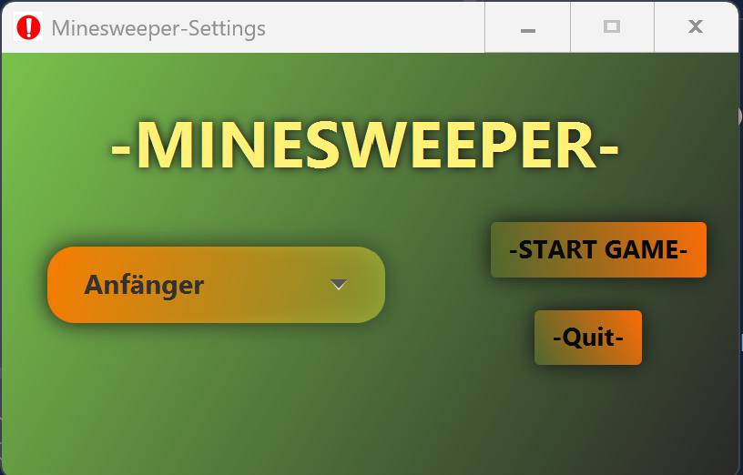
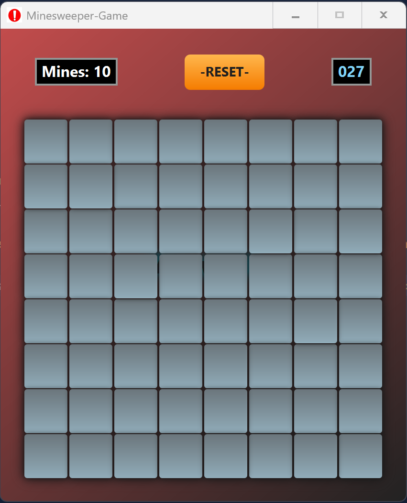

# Minesweeper-LKreisma

### A Project made for the ITP lesson at HTL Steyr

#### Its a recreation of the classic Minesweeper game with JavaFx. 

---

## - Gameplay / Features

- When you first start the game, the class ```StartApplication.java``` is called, which loads
the FXML file ``settings-view.fxml`` to edit the difficulty of the game.



- After clicking on "-START GAME-", a new window opens with the use of ```Field.java``` and the method ```createGameField()```.



---

## - How to Download and Run
1. Make sure you have Java 17 or higher installed on your machine.
2. Make shure you have the version Temurin Temurin-25 ```Eclipse Temurin-25.0.1``` installed.
3. Use an IDE like IntelliJ IDEA or Eclipse to import the project as a Maven project
2. Download the project file from the repository as a ZIP file and extract it 

## - Project Structure (Code Overview)

---

###### ©  Kreismayr Lorenz - Minesweeper